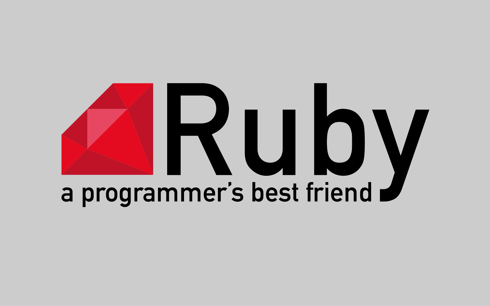

# Curso Básico de Ruby

Ruby es un lenguaje de programación creado por Matz en 1995, es open source y fue popularizado por Rails en 2005.
Este lenguaje es dinámico, interpretado y orientado a objetos (todo es un objeto).
Su objetivo es la felicidad y productividad del desarrollador.

## Ventajas

- Comunidad muy grande
- Muchas librerías
- Constantes actualizaciones
- Lenguaje maduro

## Desventajas

- Interpretado puede significar lento
- Alto uso de memoria
- No paralelismo
- Ha venido decreciendo en popularidad
